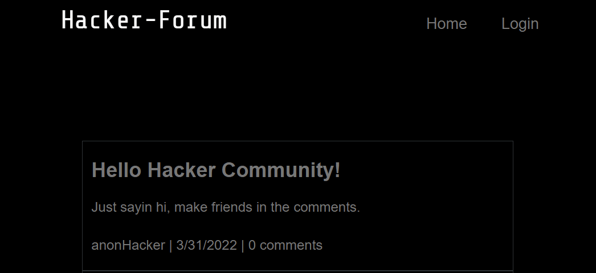
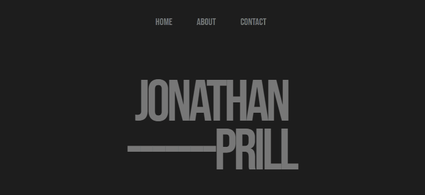
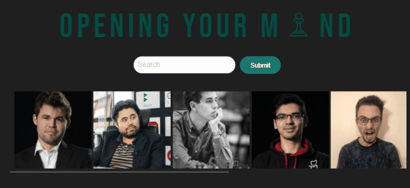
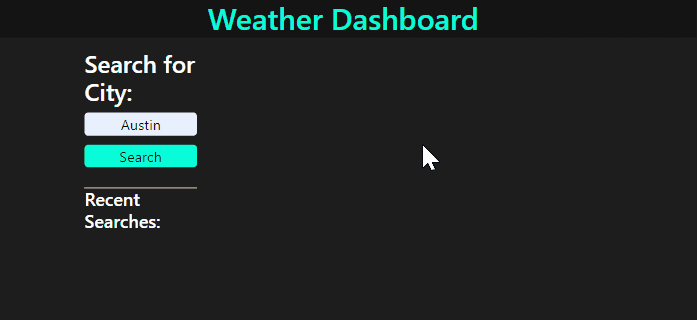

    

 

 

 

<h2 align="center">Languages and Tools</h2>
 

    
    
    
    
    
    
    
    
    
    
    

 

<!-- <h2 align="center">Featured Projects</h2>

<a target="_blank" href="https://nameless-sands-05757.herokuapp.com/">

 
</a>

 
 

<a target="_blank" href="https://jonathanprill.github.io/personal-portfolio/">

 
</a>

 
  -->

<!-- <a target="_blank" href="https://jowstafford.github.io/ChessMaster/">

 
</a> -->

<!--  
 

<a target="_blank" href="https://jonathanprill.github.io/weather-dashboard/">

 
</a>

 
 

<a target="_blank" href="https://rocky-savannah-08577.herokuapp.com/">

 
</a> -->
